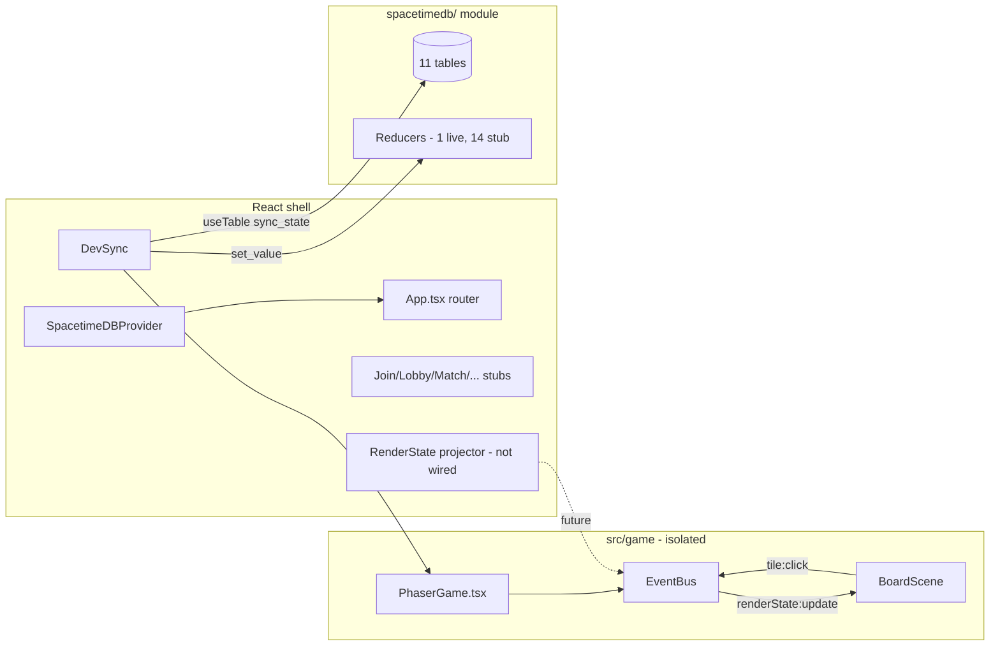

# Bodega Blitz — Application State (Technical)

Living snapshot of the repo as implemented. Use this for onboarding, handoffs, and “where are we?” checks.

**Last updated:** June 6, 2026  
**Phase:** Wave 0 complete + early renderer/assets work; gameplay reducers scaffolded only.

---

## One-line summary

Multiplayer NYC bodega territory game: **SpacetimeDB 2.x** is the source of truth, **React** owns UI/subscriptions, **Phaser 4.1** renders a **2.5D isometric board** from baked GLB sprites. Only the **dev round-trip** (`sync_state` + `set_value`) is live; all game reducers are stubbed.

---

## Stack

| Layer | Tech | Version / notes |
|-------|------|-----------------|
| Backend | SpacetimeDB TypeScript module | `spacetimedb@^2.4.1` |
| Client | React + Vite | React 18, Vite 7 |
| Renderer | Phaser (library, not template) | `phaser@4.1.0` |
| Styling | Tailwind CSS | v4 via `@tailwindcss/vite` |
| Asset bake | Python `trimesh` + `pyrender` | Headless GLB → iso PNG (no Blender required) |
| Tests | Node built-in `node:test` | 17 unit/scaffold tests passing |

---

## Architecture



### Ownership boundaries

| Owner | Path | Rule |
|-------|------|------|
| Dev A (spine) | `spacetimedb/`, `src/renderState.ts`, `src/App.tsx`, `src/screens/` | Schema + frozen render contract |
| Dev B (board) | `src/game/` | **Never** imports `module_bindings`; reads `RenderState` only |
| Dev D (assets) | `public/assets/`, `scripts/bake_iso.py`, `ASSETS.md` | Baked PNGs committed; GLBs gitignored |

---

## What works today

### Live (verified)

- `npm run dev` — Vite client + local SpacetimeDB (`ws://127.0.0.1:3000`)
- `npm test` — 60 scaffold checks + 17 unit tests green
- `npm run build` — TypeScript + production bundle
- **Two-tab sync** via `DevSync`: `sync_state` row updates across clients through `set_value`
- **Phaser canvas** on DevSync: 12×8 isometric board with **GLB-baked sprites** (demo layout when `RenderState.tiles` is empty)
- **EventBus**: `renderState:update` in, `tile:click` out
- Generated client bindings (`npm run spacetime:generate` → `src/module_bindings/`)

### Scaffolded (types/bindings exist, logic throws)

All gameplay reducers except `set_value` throw `not implemented`. Signatures and generated TS bindings are stable for parallel client work.

| File | Reducers |
|------|----------|
| `reducers.room.ts` | `create_room`, `join_room`, `start_round`, `end_round`, `rematch`, `reset_demo_room`, `tick_round` |
| `reducers.player.ts` | `register_player`, `move_player`, `claim_tile`, `contest_tile`, `collect_pickup` |
| `reducers.spectator.ts` | `trigger_spectator_event` |
| `reducers.flavor.ts` | `post_taunt` |

### Stub / placeholder

| Area | State |
|------|-------|
| `spacetimedb/src/map.ts` | Dimensions + spawn corners only; `tileTypeAt()` returns `'street'` for every cell |
| `src/screens/*.tsx` | Join, Lobby, Match, Results, Judge — UI shells with back-nav only |
| `App.tsx` router | Defaults to `dev`; no room-driven navigation |
| RenderState projection | No hook yet maps `useTable` rows → `RenderState` (Phaser uses demo layout) |
| `agents/` | Provider stubs only (`groq`, `gemini`, `static`); no `phrases.json`, no `run-flavor.ts` |
| `round_tick` scheduled reducer | Table defined; `tick_round` body not implemented |

---

## SpacetimeDB schema

**Module path:** `spacetimedb/`  
**Database name:** `bodega-blitz` (configurable via `VITE_SPACETIMEDB_DB_NAME`)

| Table | Purpose | Status |
|-------|---------|--------|
| `sync_state` | Phase 0 round-trip proof (single row) | **Live** — remove after Slice 2 |
| `rooms` | Room lifecycle, timer, host | Schema only |
| `players` | Identity, role, color, room scope | Schema only |
| `player_state` | Grid position, cash, cooldowns | Schema only |
| `spectator_state` | Energy economy | Schema only |
| `tiles` | Per-cell ownership, income, effects | Schema only |
| `pickups` | Active pickups per room | Schema only |
| `events` | Action feed | Schema only |
| `taunts` | LLM/static flavor lines | Schema only |
| `round_results` | End-of-round standings | Schema only |
| `round_tick` | Scheduled 1s tick target | Schema only |

**Isolation model:** Single database, strict `room_id` on every table and subscription (no per-room DB).

---

## Frozen render contract (`src/renderState.ts`)

Phaser scenes consume **only** this shape:

```typescript
interface RenderState {
  readonly width: number;   // 12
  readonly height: number;  // 8
  readonly tiles: readonly RenderTile[];
  readonly tokens: readonly RenderToken[];
  readonly pickups: readonly RenderPickup[];
}
```

React will project DB rows into `RenderState` and push via `EventBus.emitRenderState()`. Phaser must not import `module_bindings`.

---

## Phaser renderer (`src/game/`)

### Files

| File | Role |
|------|------|
| `PhaserGame.tsx` | Mount/destroy `Phaser.Game`; FIT scale; pushes `RenderState` on change |
| `EventBus.ts` | Typed emitter bridge |
| `iso.ts` | 64×32 diamond grid; `gridToScreen()`; `isoDepth(gx + gy)` |
| `boardLayout.ts` | Demo bodegas/alleys/trees/tokens when `tiles`/`tokens` empty |
| `spriteKeys.ts` | Atlas frame key mapping |
| `scenes/BoardScene.ts` | Preload atlas, depth-sorted sprite draw, tile click zones |

### Isometric rules

- **Projection:** `x = (gx - gy) * 32`, `y = (gx + gy) * 16` (2:1 cells)
- **Depth:** `setDepth(gridX + gridY + offset)` — **not** `gy * GRID_W + gx`
  - Tiles: `-0.5`, trees: `+0.2`, pickups: `+0.15`, tokens: `+0.1`
- **Sprite origin:** `(0.5, 0.85)` — matches bake anchor
- **Demo occlusion test:** token at `(1,2)`, bodega at `(10,0)` — validates corner depth sorting

### Atlas

| File | Contents |
|------|----------|
| `public/assets/bodega-atlas.png` | 12 frames @ 128×256 |
| `public/assets/bodega-atlas.json` | Phaser atlas JSON |

Frames: `tile_street`, `tile_bodega`, `tile_alley`, `tree`, `token_p1`–`p4`, `pickup_cash`, `pickup_coffee`, `pickup_shield`.

---

## Asset pipeline (3D → 2.5D)

```
assets-source/glb/*.glb     (gitignored — Kenney CC0 commercial kit)
        ↓  scripts/bake_iso.py  (pyrender, elev 30° / azim 45°, ortho)
public/assets/sprites/raw/*.png   (gitignored intermediates)
        ↓  scripts/prepare_tokens.py  (Kenney iso human PNGs)
        ↓  scripts/pack_atlas.py
public/assets/bodega-atlas.{png,json}   (committed)
```

```bash
npm run assets:rebuild   # bake + pack
```

Sources documented in `ASSETS.md`. Sketchfab CC0 GLBs drop into `assets-source/glb/` with the same workflow.

---

## Client routing

```typescript
type Screen = 'dev' | 'join' | 'lobby' | 'match' | 'results' | 'judge';
```

| Screen | File | Status |
|--------|------|--------|
| `dev` (default) | `components/DevSync.tsx` | **Active** — sync proof + Phaser canvas |
| `join` | `screens/Join.tsx` | Stub |
| `lobby` | `screens/Lobby.tsx` | Stub |
| `match` | `screens/Match.tsx` | Stub — Phaser not mounted here yet |
| `results` | `screens/Results.tsx` | Stub |
| `judge` | `screens/Judge.tsx` | Stub |

---

## Environment

| Variable | Default |
|----------|---------|
| `VITE_SPACETIMEDB_HOST` | `ws://127.0.0.1:3000` |
| `VITE_SPACETIMEDB_DB_NAME` | `bodega-blitz` |

Auth token persisted in `localStorage` at `{host}/{db}/auth_token`.

---

## Commands

```bash
# Dev
spacetime dev                          # local SpacetimeDB + logs
npm run dev                            # Vite client

# Bindings (required on fresh clone)
npm run spacetime:generate

# Verify
npm test
npm run build

# Publish
npm run spacetime:publish:local
npm run spacetime:publish              # Maincloud

# Assets
npm run assets:rebuild
```

---

## Build slices progress (from brief)

| Slice | Status |
|-------|--------|
| 1 — Base app | ✅ Done |
| 2 — Room sync | ⬜ Schema/bindings only; reducers stub; Match screen empty |
| 3 — Claim + results | ⬜ |
| 4 — Scoring + auto-end | ⬜ `tick_round` unverified |
| 5 — Contest + pickups | ⬜ |
| 6 — Spectators | ⬜ |
| 7 — Judge + resilience | ⬜ |
| 8 — Phaser sprites | 🟡 Atlas + BoardScene done; not wired to live `RenderState` |
| 9 — LLM flavor | ⬜ Provider stubs only |
| 10 — Polish | ⬜ |

---

## Open spikes (do not assume)

1. SpacetimeDB 2.0 **scheduled reducer** exact syntax for `round_tick`
2. Filtered `useTable` (`WHERE room_id = ?`) subscription syntax
3. Maincloud cold-wake before demo
4. Groq / Gemini model strings for flavor worker

---

## Key files quick reference

```
bodega-blitz/
├── spacetimedb/src/
│   ├── schema.ts          # table registry
│   ├── tables.ts          # 11 table defs
│   ├── map.ts             # 12×8 stub layout
│   ├── reducers.*.ts      # game logic (mostly throw)
│   └── index.ts           # module export
├── src/
│   ├── renderState.ts     # FROZEN Phaser contract
│   ├── App.tsx            # screen router
│   ├── components/DevSync.tsx
│   ├── game/              # Phaser layer (isolated)
│   ├── screens/           # game UI stubs
│   └── module_bindings/   # generated — do not edit
├── public/assets/
│   ├── bodega-atlas.png
│   └── bodega-atlas.json
├── scripts/
│   ├── bake_iso.py
│   ├── pack_atlas.py
│   └── check-roundtrip-scaffold.mjs
├── ASSETS.md
├── bodega-blitz-cursor-brief.md   # full game spec
└── docs/checklist.md              # living task tracker
```

---

## Immediate next integration steps

1. Implement `create_room` / `join_room` / `start_round` + seed `tiles` from `map.ts`
2. Add `useTable` subscriptions filtered by `room_id` in Match screen
3. Project DB rows → `RenderState` in React; pass to `<PhaserGame renderState={...} />`
4. Wire `EventBus.onTileClick` → `move_player` / `claim_tile` reducers
5. Move Phaser mount from `DevSync` to `MatchScreen`; retire `sync_state` when Slice 2 lands
